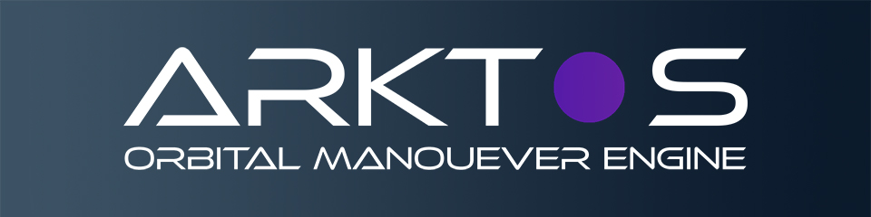
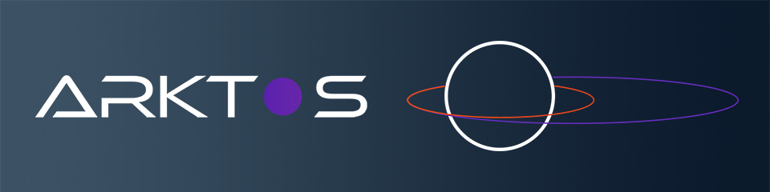

Arktos
&middot;
[](https://github.com/minorDeveloper/Arktos/actions/workflows/build.yml)
[](https://codecov.io/gh/minorDeveloper/Arktos)
=====

Arktos is an Orbital Manoever Engine for the simulation and optimization of spacecraft trajectories in an n-body system. The project is primarily written in C++ with CUDA kernels available for increased performance.

This project utilizes the [Magnum](https://magnum.graphics/) engine for visualization using OpenGL.

To download the executable head on over to [releases](https://github.com/minorDeveloper/Arktos/releases) and grab the latest version!

## Features
 * It builds!

## Contents
-- [Features](#features)
-- [Building](#building)
-- [Usage and examples](#usage-and-examples)
-- [Development and contributing](#development-and-contributing)
-- [Acknowledgments](#acknowledgments)


## Building

Arktos is built using CMake, and its dependencies are included as git submodules (aside from SDL which is bundled for Windows builds).

Start by downloading the project.

```
git clone --recursive git://github.com/minorDeveloper/Arktos.git
cd Arktos
```


### Installing dependencies

#### Linux (Ubuntu)

```
sudo apt-get upgrade
sudo apt install libsdl2-dev
```

#### MacOS

```
brew install sdl2
```

#### Windows

SDL for windows is bundled with Arktos, no additional steps are necessary.

### Build project

```
mkdir build && cd build
cmake build ..
cmake --build --config Debug
```

### Run tests

```
ctest -C Debug --verbose
```

## Usage and examples

TODO

## Development and contributing
I welcome pull requests and will take a look at any [issues](https://github.com/minorDeveloper/Arktos/issues/new/choose) raised. If you want to see where the development of Arktos is headed then take a look at the [projects](https://github.com/minorDeveloper/Arktos/projects) page.

## Acknowledgments




## License
[](https://app.fossa.com/projects/git%2Bgithub.com%2FminorDeveloper%2FArktos?ref=badge_large)
